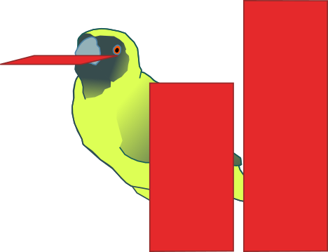

Pyconstruct
===========

<div align="center">
  <br><br>
</div>

**Pyconstruct** is a Python library for declarative, constrained,
structured-output prediction. When using Pyconstruct, the problem specification
can be encoded in MiniZinc, a high-level constraint programming language. This
means that domain knowledge can be declaratively included in the inference
procedure as constraints over the optimization variables.

Sounds complicated? A simple example will clear up the doubts!


Getting started
---------------

In the following example we will implement a simple OCR (Optical Character
Recognition) model in few lines of MiniZinc.

First of all, lets fetch the data. Pyconstruct has a utility for getting some
standard datasets::

```python
    from pyconstruct import datasets
    ocr = datasets.load('ocr')
```

The first time the dataset is loaded it will actually be fetched from the web
and stored locally. You can now see the description of the dataset::

```python
    print(ocr.descr)
```

By default, structured objects are represented as Python dictionaries in
Pyconstruct. Each objects as several "attributes", identified with some string.
Each attribute value may be any basic Python data type: strings, integers,
floats, list or other dictionaries. In OCR, for instance, inputs `X` are
represented as dictionaries containing two attributes: an integer containing the
`length` of the word; a list of `16x8` matrices (`numpy.ndarray`) containing the
bitmap images of each character in the word. The targets (labels) are also
structured objects containig a single attribute `sequence`, a list of integers
representing the letters associated to each image in the word. For instance::

```python
    print(ocr.data[0])
    print(ocr.targets[0])
```

After getting the data, we can start coding our problem. First of all, in
Pyconstruct there are three main kinds of objects to interact with: Domains,
Models and Learners. At a high level: a Domain defines the attributes and the
constraints of the structured objects; a Model is an object contaning some
parameters that can be used to make inference over a Domain; a Learner is an
algorithm that can learn a Model from data. A Domain is also responsible of
solving inference problems with respect to some Model, so the two classes are
interdependent, but in general a Domain can be made working for different
Models.

Several Models and Learners are already defined by Pyconstruct. All that is
required for start training a model, apart from the data, is a Domain encoded in
MiniZinc which defines how the attributes of the objects interact, which are the
constraints and the features of the objects. To do so, we need to create a
`ocr.pmzn` file::

```HTML+Django
    

    {{ n_features('16 * 8 * 26') }}

    

        int: length;
        array[1 .. length, 1 .. 16, 1 .. 8] of var {0, 1}: images;

        array[1 .. length] of var 1 .. 26: sequence;


        
        [
            sum(e in 1 .. length)(images[e, i, j] * (sequence[e] == s))
            | i in 1 .. 16, j in 1 .. 8, s in 1 .. 26
        ]
        

    

    {{ solve(problem, model, discretize=True) }}
```

That's it! Now we can instantiate a `Domain` with our new `ocr.pmzn` file::

```python
    from pyconstruct import Domain
    ocr_dom = Domain('ocr.pmzn')
```

If you know MiniZinc, the above code will probably look a bit odd. That is
because Pyconstruct by default uses a superset of MiniZinc defined by the PyMzn
library.  Essentially, that is MiniZinc with some tempating provided by the
Jinja2 library. Check out PyMzn for an explanation on how to use fully it. Here
we'll explain the basics.

The first line
``
imports few useful macros from the `pyconstruct.pmzn` file.

The second line `{{ n_features('16 * 8 * 26') }}` calls the `n_features` macro,
which compiles into::

```HTML+Django
    int: N_FEATURES = 16 * 8 * 26;
    set of int: FEATURES 1 .. N_FEATURES;
```

The MiniZinc code enclosed in the tags
` ... ` is processed on the basis of the
value of `problem` the domain is called with. The variable `problem` is usually
passed to the domain by an internal call of Pyconstruct through PyMzn. In this
block goes the domain definition, including the variables and parameters of the
objects, the constraints and the features. Notice that we have two MiniZinc
parameters `length` and `images`, which match the attributes of the input
objects of the OCR dataset, and one optimization variable `sequence` which
matches the attribute of the output objects of the OCR dataset. This is valid
for any problem: the examples are the inputs that are provided as dzn data,
whereas the targets are the outputs of the model, which translate into
optimization variables when solving inference.

Inside the domain call we also call the `features` macro, which compiles into::

```HTML+Django
    array[FEATURES] of var int: phi = [
        sum(e in 1 .. length)(images[e, i, j] * (sequence[e] == s))
        | i in 1 .. 16, j in 1 .. 8, s in 1 .. 26
    ];
```

These are typical features used in OCR, for each symbol `s` and each pixel `(i,
j)` in the images containing the number of times in the sequence the `(i, j)`
pixel is active for characters labeled with symbol `s`.

The last line calls the `solve` macro, which compiles to a different solve
statement depending on the `problem` and `model`. Possible values for `problem`
are, for instance, `map` to find the object with highest score (dot product
between weights and features) or `phi` to compute the feature vector given an
input and an output object. The `model` is a dictionary containing the model's
parameters, such as the weights `w` for a `LinearModel`. Also this object is
usually passed to the domain by Pyconstruct.

The above model is actually a partial example of the complete `ocr` domain
available in Pyconstruct out-of-the-box. You can load the domain by simply::

```python
    ocr_dom = Domain('ocr')
```

After defining the domain, using the predefined one or the `ocr.pmzn` file, we
can start learning by instantiating a learner, say a `StructuredPerceptron`, and
fitting the data::

```python
    from pyconstruct import StructuredPerceptron
    sp = StructuredPerceptron(domain=ocr_dom)
    sp.fit(ocr.data, ocr.targets)
```

This will take a while... If you need a quick benchmark, Pyconstruct contains
pretrained models for many domains and learners (link).


Install
-------
Pyconstruct can be installed through `pip`:

```bash
pip install pyconstruct
```

Or by downloading the code from Github and running the following from the
downloaded directory:

```bash
python setup.py install
```

After installing Pyconstruct you will need to install **MiniZinc** as well.
Download the latest release of MiniZincIDE and follow the instructions.

Authors
-------
This project is developed at the SML research group at the University of Trento
(Italy). Main developers and maintainers:

* Paolo Dragone
* Stefano Teso (now at KU Leuven)
* Andrea Passerini

